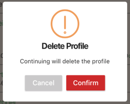

<p align="center">
    <a href="https://pub.dartlang.org/packages/sweetalert">
        
    </a>
 </p>

# sweetalert

sweetalert for flutter.

## Showcases


## Getting started

### Add dependency

```
sweetalert: any
```

### Usage


#### Basic usage


```
 SweetAlert.show(context, title: "Just show a message");
```

#### With a subtitle


```
 SweetAlert.show(context,
                      title: "Just show a message",
                      subtitle: "Sweet alert is pretty");
```

#### With a success state


```
 SweetAlert.show(context,
                      title: "Just show a message",
                      subtitle: "Sweet alert is pretty",
                      style: SweetAlertStyle.success);
```

#### With a confirm state


```
SweetAlert.show(context,
                      title: "Just show a message",
                      subtitle: "Sweet alert is pretty",
                      style: SweetAlertStyle.confirm,
                      showCancelButton: true, onPress: (bool isConfirm) {
        if (isConfirm) {
          SweetAlert.show(context,style: SweetAlertStyle.success,title: "Success");
          // return false to keep dialog
          return false;
        }
      });
```

#### Do some job

```
 SweetAlert.show(context,
          subtitle: "Do you want to delete this message",
          style: SweetAlertStyle.confirm,
          showCancelButton: true, onPress: (bool isConfirm) {
        if(isConfirm){
          SweetAlert.show(context,subtitle: "Deleting...", style: SweetAlertStyle.loading);
          new Future.delayed(new Duration(seconds: 2),(){
            SweetAlert.show(context,subtitle: "Success!", style: SweetAlertStyle.success);
          });
        }else{
          SweetAlert.show(context,subtitle: "Canceled!", style: SweetAlertStyle.error);
        }
        // return false to keep dialog
        return false;
      });
```

#### With Widgets for Title and Subtitle




```
    SweetAlert.show(context,
        titleText: Padding(
          padding: EdgeInsets.symmetric(vertical: 8.0),
          child: Text("Delete Profile", style: theme.textTheme.title.copyWith(fontWeight: FontWeight.bold),)
        ),
        subtitleText: Padding(
          padding: EdgeInsets.symmetric(vertical: 8.0),
          child: Text("Continuing will delete the profile", style: theme.textTheme.body1),
        ),
        confirmButtonColor: theme.errorColor,
        //cancelButtonColor: theme.buttonTheme.colorScheme.primary,
        style: SweetAlertStyle.confirm,
        showCancelButton: true,
        onPress: (bool isConfirm) {
          return true;
        });
```
