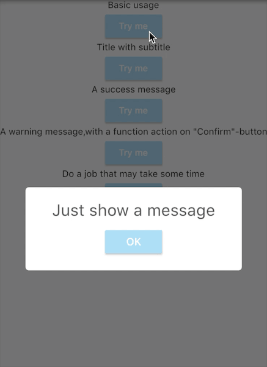
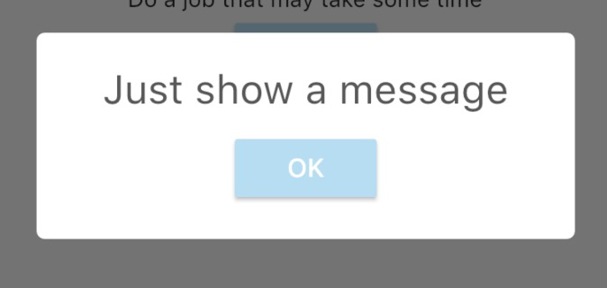
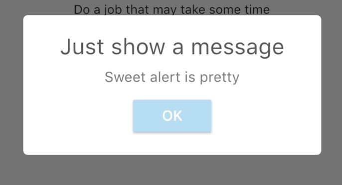
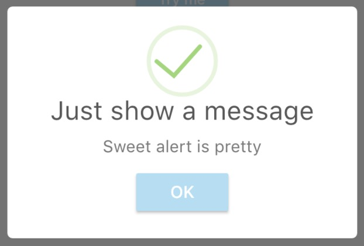

# sweetalert

sweetalert for flutter.

## Showcases



## Getting started

### Add dependency

```
sweetalert: any
```

### Usage


#### Basic usage


```
 SweetAlert.show(context, title: "Just show a message");
```

#### With a subtitle



```
 SweetAlert.show(context,
                      title: "Just show a message",
                      subtitle: "Sweet alert is pretty");
```

#### With a success state



```
 SweetAlert.show(context,
                      title: "Just show a message",
                      subtitle: "Sweet alert is pretty",
                      style: SweetAlertStyle.success);
```

#### With a confirm state


```
SweetAlert.show(context,
                      title: "Just show a message",
                      subtitle: "Sweet alert is pretty",
                      style: SweetAlertStyle.confirm,
                      showCancelButton: true, onPress: (bool isConfirm) {
        if (isConfirm) {
          SweetAlert.show(context,style: SweetAlertStyle.success,title: "Success");
          // return false to keep dialog
          return false;
        }
      });
```

#### Do some job

```
 SweetAlert.show(context,
          subtitle: "Do you want to delete this message",
          style: SweetAlertStyle.confirm,
          showCancelButton: true, onPress: (bool isConfirm) {
        if(isConfirm){
          SweetAlert.show(context,subtitle: "Deleting...", style: SweetAlertStyle.loading);
          new Future.delayed(new Duration(seconds: 2),(){
            SweetAlert.show(context,subtitle: "Success!", style: SweetAlertStyle.success);
          });
        }else{
          SweetAlert.show(context,subtitle: "Canceled!", style: SweetAlertStyle.error);
        }
        // return false to keep dialog
        return false;
      });
```